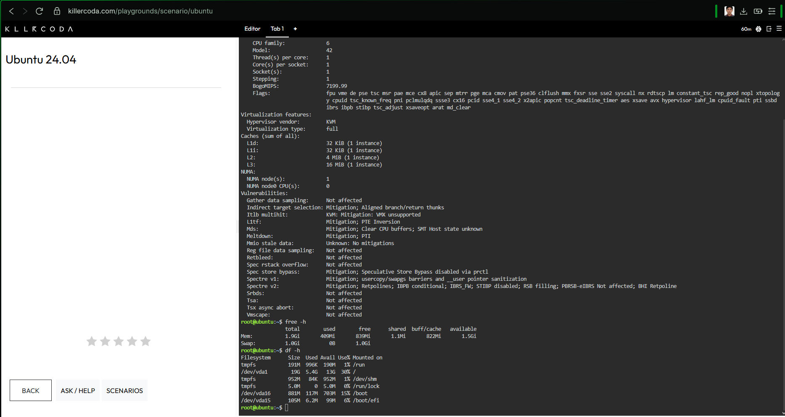
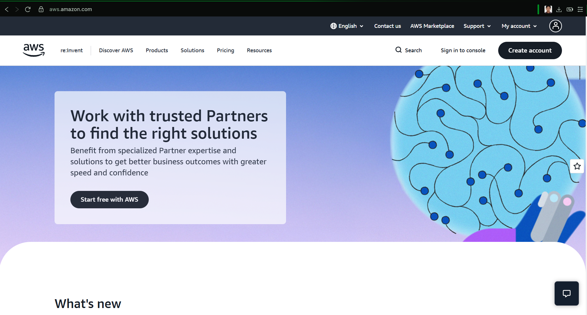
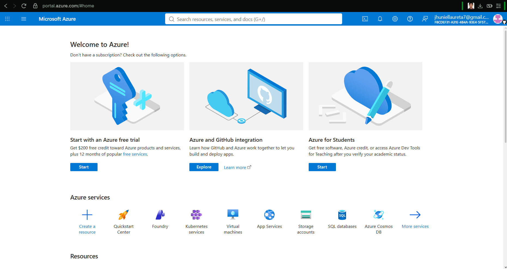
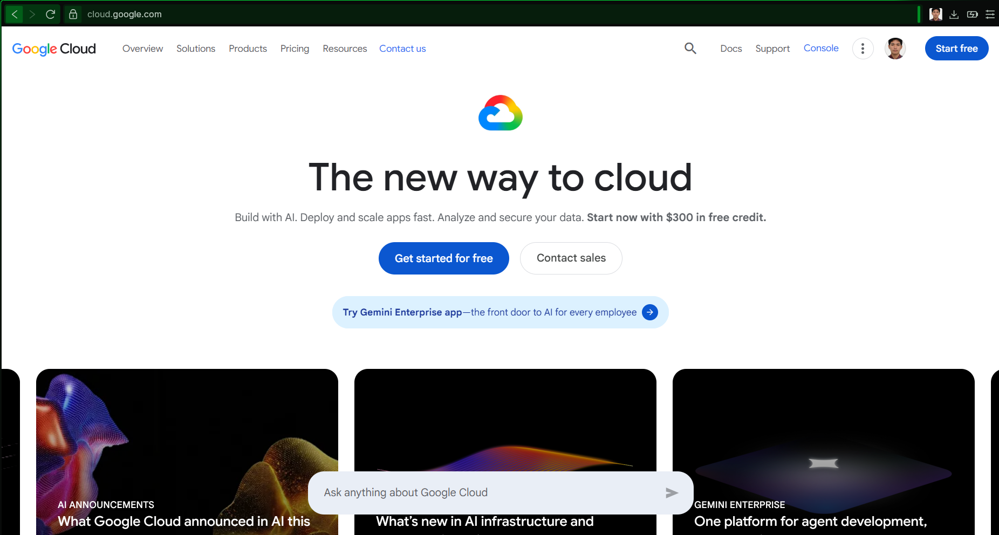
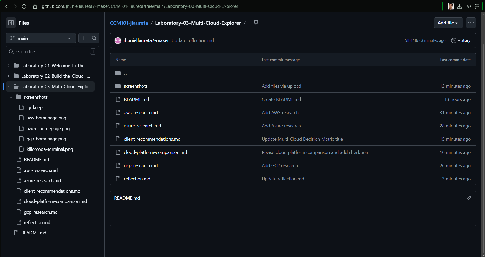

# CCM101 – Cloud Computing Laboratory Activity 3

# Mission 3: Become a Multi-Cloud Explorer

**Student Name:** Jhuniel Laureta
**Course:** BSIT
**Subject:** CCM101 – Cloud Computing

---

## Mission Overview

This laboratory activity focuses on exploring and comparing the three major cloud platforms:

* Amazon Web Services (AWS)
* Microsoft Azure
* Google Cloud Platform (GCP)

The goal of this mission is to understand their core services, advantages, infrastructure, and suitable business use cases.

---

# Checkpoint 1 – Repository Setup

The laboratory files are organized inside the following folder:

`Laboratory-03-Multi-Cloud-Explorer`

The folder contains the research documents, comparison, client recommendations, reflection, and screenshots required for the activity.

---

# Checkpoint 2 – Cloud Platform Research

## AWS

AWS is a cloud computing platform that provides services for computing, storage, networking, databases, security, and other cloud requirements.

### Core Services

* Amazon EC2 – Compute
* Amazon S3 – Object Storage
* Amazon VPC – Networking
* AWS IAM – Identity and Access Management

### Advantages

* Wide range of cloud services
* Global infrastructure
* Scalable and flexible resources

### Enterprise Use Cases

AWS can be used for web applications, data storage, enterprise applications, backup and recovery, and other large-scale workloads.

**Official AWS Resources:**

* AWS Overview: https://docs.aws.amazon.com/whitepapers/latest/aws-overview/introduction.html
* AWS Global Infrastructure: https://aws.amazon.com/about-aws/global-infrastructure/global-network/
* AWS Management Console: https://aws.amazon.com/console/
* AWS Compute Services: https://docs.aws.amazon.com/whitepapers/latest/aws-overview/compute-services.html
* AWS Storage: https://aws.amazon.com/solutions/storage/
* AWS Networking: https://aws.amazon.com/products/networking/
* AWS Identity: https://aws.amazon.com/identity/
* AWS Enterprise: https://aws.amazon.com/enterprise/

---

## Microsoft Azure

Azure is Microsoft's cloud computing platform that provides services for computing, storage, networking, databases, identity, analytics, and artificial intelligence.

### Core Services

* Azure Virtual Machines – Compute
* Azure Blob Storage – Storage
* Azure Virtual Network – Networking
* Microsoft Entra ID – Identity

### Advantages

* Strong Microsoft integration
* Scalable cloud infrastructure
* Supports enterprise applications

### Enterprise Use Cases

Azure can be used for enterprise applications, Microsoft 365 integration, Windows Server workloads, databases, virtual machines, and AI solutions.

---

## Google Cloud Platform (GCP)

Google Cloud Platform provides cloud services for computing, storage, networking, databases, artificial intelligence, machine learning, and containerized applications.

### Core Services

* Compute Engine – Compute
* Cloud Storage – Object Storage
* Virtual Private Cloud – Networking
* Cloud Identity – Identity

### Advantages

* Strong AI and machine learning capabilities
* Strong Kubernetes support
* Scalable global infrastructure

### Enterprise Use Cases

GCP can be used for AI and machine learning, data analytics, web applications, Kubernetes deployments, and large-scale data processing.

---

# Checkpoint 3 – Cloud Platform Comparison

| Category            | AWS                                            | Azure                         | GCP                                      |
| ------------------- | ---------------------------------------------- | ----------------------------- | ---------------------------------------- |
| Launch Year         | 2006                                           | 2010                          | 2008                                     |
| Compute Service     | Amazon EC2                                     | Azure Virtual Machines        | Compute Engine                           |
| Storage Service     | Amazon S3                                      | Azure Blob Storage            | Cloud Storage                            |
| Networking Service  | Amazon VPC                                     | Azure Virtual Network         | Google VPC                               |
| Identity Service    | AWS IAM                                        | Microsoft Entra ID            | Cloud Identity                           |
| Primary Strength    | Broad range of services                        | Microsoft integration         | AI, data, and Kubernetes                 |
| Ideal Organizations | Startups, enterprises, and large organizations | Microsoft-based organizations | AI, data, and cloud-native organizations |

### 1. Which platform offers the broadest range of services?

AWS offers a very broad range of cloud services covering computing, storage, networking, databases, security, analytics, and many other areas. This makes it suitable for organizations with different types of cloud requirements.

### 2. Which platform is best for organizations heavily invested in Microsoft technologies?

Azure is a strong choice for organizations that already use Microsoft technologies. It provides good integration with Windows Server, Microsoft 365, and Microsoft identity services.

### 3. Which platform is strongest for AI and Kubernetes workloads?

GCP is a strong option for AI, machine learning, and Kubernetes workloads. Its cloud services support data processing, machine learning, and containerized applications.

### 4. Which platform would you personally choose and why?

I would personally choose AWS because it provides many services that can support different types of projects. It also gives users flexibility when selecting computing, storage, networking, and other cloud services.

---

# Checkpoint 4 – Client Recommendations

## Client A – Startup Company

**Recommended Platform: AWS**

AWS is a good choice for a startup with a limited budget and plans for rapid growth. The company can start with services such as Amazon EC2 for computing, Amazon S3 for storage, and Amazon RDS for databases. These services can scale as the company grows. AWS also provides many services that can help startups build applications without needing to maintain physical servers.

## Client B – University Using Microsoft Technologies

**Recommended Platform: Azure**

Azure is suitable for a university that already uses Windows Server, Microsoft 365, and Active Directory. Services such as Azure Virtual Machines, Microsoft Entra ID, and Azure Storage can integrate well with the university's existing Microsoft environment. This can make cloud migration easier. Azure can also support the university's applications and infrastructure.

## Client C – AI Research Company

**Recommended Platform: GCP**

GCP is a strong choice for an AI research company because of its AI, machine learning, and data processing capabilities. Services such as Compute Engine, Google Kubernetes Engine, and Vertex AI can support AI and machine learning workloads. The company can use scalable cloud resources for research and high-performance computing requirements.

## Client D – Global E-Commerce Company

**Recommended Platform: AWS**

AWS is a suitable platform for a global e-commerce company that needs high availability and automatic scaling. Services such as Amazon EC2, Amazon S3, and Elastic Load Balancing can support web applications and distribute traffic. AWS Auto Scaling can also help increase or decrease resources depending on demand.

---

# Checkpoint 5 – Service Matching

| Requirement         | AWS        | Azure                          | GCP                            |
| ------------------- | ---------- | ------------------------------ | ------------------------------ |
| Virtual Machine     | Amazon EC2 | Azure Virtual Machines         | Compute Engine                 |
| Object Storage      | Amazon S3  | Azure Blob Storage             | Cloud Storage                  |
| Identity Management | AWS IAM    | Microsoft Entra ID             | Cloud Identity                 |
| SQL Database        | Amazon RDS | Azure SQL Database             | Cloud SQL                      |
| Kubernetes          | Amazon EKS | Azure Kubernetes Service (AKS) | Google Kubernetes Engine (GKE) |

---

# Checkpoint 6 – Decision Matrix

| Requirement             | Recommended Platform | Reason                                       |
| ----------------------- | -------------------- | -------------------------------------------- |
| Startup Company         | AWS                  | Wide range of scalable services              |
| Enterprise Organization | AWS                  | Broad enterprise services                    |
| Microsoft Environment   | Azure                | Strong Microsoft integration                 |
| AI/ML                   | GCP                  | Strong AI and machine learning services      |
| Kubernetes Deployment   | GCP                  | Strong Kubernetes support                    |
| Global Web Application  | AWS                  | Scalable and highly available infrastructure |

---

# Checkpoint 7 – Linux Investigation

A Linux server was investigated using a KillerCoda Playground. Linux commands were used to identify the operating system, CPU information, memory, and disk space.

## Linux Server Information

### Operating System

The operating system was identified using Linux system information commands.

### CPU Information

The CPU information was checked using Linux commands to determine the processor available on the server.

### Memory

The server's memory usage and available memory were checked using Linux memory commands.

### Disk Space

The available disk space and disk usage were checked using Linux disk commands.

## Cloud Migration

### Question:

**If this Linux server were migrated to the cloud, which AWS, Azure, and GCP services could host it?**

### Answer:

If this Linux server were migrated to the cloud, it could be hosted using virtual machine services from AWS, Azure, or GCP.

* **AWS:** Amazon EC2 can host a Linux-based virtual server in the AWS cloud.
* **Azure:** Azure Virtual Machines can host Linux server workloads.
* **GCP:** Compute Engine can host Linux virtual machines.

These services allow users to create and manage virtual servers in the cloud without needing to maintain physical server hardware.

## Terminal Screenshot

The screenshot below shows the Linux investigation performed in the KillerCoda Playground.

---

# Screenshots and Evidence

## AWS Homepage

## Azure Homepage

## Google Cloud Homepage

## KillerCoda Terminal

## GitHub Repository

---

# Screenshot Evidence Summary

| Screenshot                | Purpose                                 |
| ------------------------- | --------------------------------------- |
| `aws-homepage.png`        | Evidence of AWS research                |
| `azure-homepage.png`      | Evidence of Azure research              |
| `gcp-homepage.png`        | Evidence of GCP research                |
| `killercoda-terminal.png` | Evidence of Linux investigation         |
| `github-repository.png`   | Evidence of completed GitHub repository |

---

# Files in This Mission

The following files are included in this laboratory activity:

* `README.md`
* `aws-research.md`
* `azure-research.md`
* `gcp-research.md`
* `cloud-platform-comparison.md`
* `client-recommendations.md`
* `reflection.md`
* `screenshots/aws-homepage.png`
* `screenshots/azure-homepage.png`
* `screenshots/gcp-homepage.png`
* `screenshots/killercoda-terminal.png`
* `screenshots/github-repository.png`

---

# Conclusion

This mission helped me understand the differences and similarities between AWS, Azure, and GCP. It also helped me understand that choosing a cloud platform depends on the specific requirements, budget, technology, and goals of an organization.

The activity also improved my practical skills in Linux, cloud computing research, documentation, and GitHub portfolio management.
